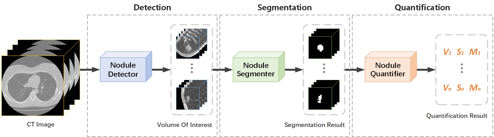

# PN-Quant (IEEE BIBM 2024)

Official Pytorch implementation of PN-Quant, from the following paper:

**PN-Quant: An Automated Pulmonary Nodule Quantification Method for Full-Size CT Scans.**

[BIBM 2024](https://www.ieeebibm.org/BIBM2024/) (Accepted at 16 Aug. 2024, [Regular Paper](https://ieeexplore.ieee.org/document/))

[Xinkai Tang](https://xinkai-tang.github.io), Zhiyu Zhu, Feng Liu, *et al.*

School of Computer Science, Wuhan University, China


## Introduction



We propose a general pulmonary nodule quantification framework named PN-Quant. It integrates a detection module, a segmentation module, and a quantification module to enable automated identification and precise measurement of lung nodules in full-size Computer Tomography (CT) scans, which facilitates the extraction of geometric characteristics, including volume, surface area, mass, sphericity, compactness, and elongation, offering valuable quantitative data for accurate nodule assessment.


## Quantification Results

* **Dice Similarity Coefficient (DSC, %, ↑)**

| Detector  | Segmentor | LIDC-IDRI         | LNDb-19           | MSD-lung          |
| --------- | --------- | ----------------- | ----------------- | ----------------- |
| NoduleNet | SwinUNETR | 78.10 ± 13.17     | 72.65 ± 14.54     | 77.45 ± 13.53     |
| NoduleNet | 3D UX-Net | 78.75 ± 13.15     | 73.10 ± 14.70     | 78.36 ± 13.20     |
| SANet     | SwinUNETR | 83.69 ± 13.60     | 73.20 ± 15.48     | 78.20 ± 13.37     |
| SANet     | 3D UX-Net | **84.39 ± 13.44** | **73.28 ± 15.49** | **79.02 ± 13.11** |

* **Mean Relative Error (MRE, %, ↓)**

| Detector  | Segmentor | LIDC-IDRI       | LNDb-19          | MSD-lung        |
| --------- | --------- | --------------- | ---------------- | --------------- |
| NoduleNet | SwinUNETR | 18.3 ± 47.6     | 46.0 ± 120.5     | 25.7 ± 21.0     |
| NoduleNet | 3D UX-Net | 17.0 ± 51.5     | 42.7 ± 109.2     | 25.2 ± 19.1     |
| SANet     | SwinUNETR | 18.5 ± 48.0     | 40.1 ± 99.1      | 25.9 ± 19.6     |
| SANet     | 3D UX-Net | **16.8 ± 50.0** | **39.5 ± 105.3** | **24.4 ± 18.7** |


## Acknowledgement
This work is supported by National Natural Science Foundation of China (NSFC No.62172309).


## Citation 
If you find this repository helpful, please consider citing:
```
@article{tang2024pn,
  title={PN-Quant: An Automated Pulmonary Nodule Quantification Method for Full-Size CT Scans},
  author={Tang, Xinkai and Zhu, zhiyu and Liu, Feng and Chen, Yi Ping Phoebe and Huang, Wencai and Zou, Jiani},
  booktitle={2024 IEEE International Conference on Bioinformatics and Biomedicine (BIBM)},
  pages={},
  year={2024},
  organization={IEEE}
}
```
ATTENTION: This paper has not been publicly published yet!!!
